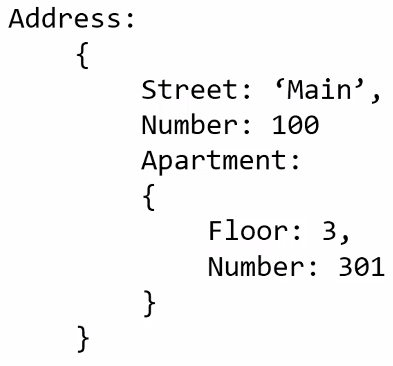

# Name/Value Pairs and Objects

> Objects are incrediably important!

## Name/Value Pair

> **A name which maps to a unique value.**

The name may be defined more than once, but only can have one value in any given **execution context**.

That value may be more name/value pairs.

## Object

> **A collection of name value pairs.**

The simplest definition when talking about JavaScript.

