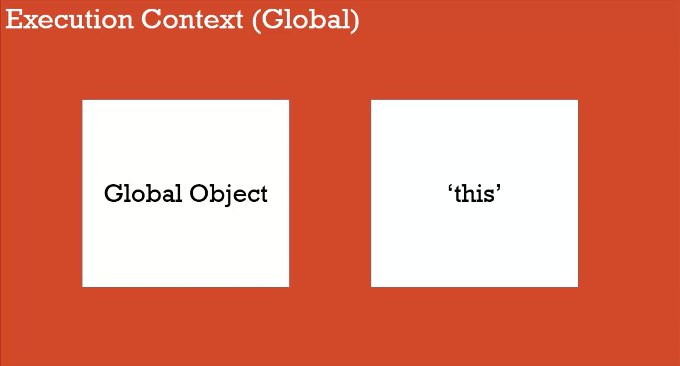
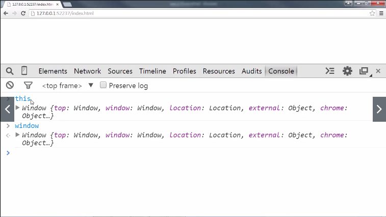
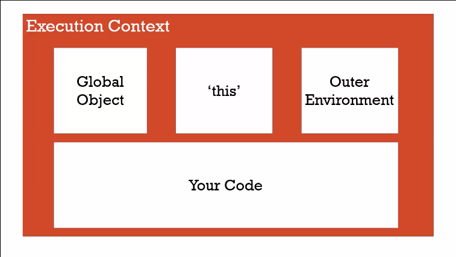

# The Global Environment and The Global Object

The global context creates a global object for you and "this", a special variable for you by the JS Engine.

In the case of browser tab, "window" is the global object for this tab. Other tabs will have their own execution context, so they will have their own glo bal object "window".

I have these two variables while I have no code. JS engine created these two variables for me.

## Global

``global`` means that this global variable is available to all the code running inside that window, inside that area, inside that JavaScript file, inside that lexical environment.

At the global level, the global object "window" and "this" are equal.

> Global = code or variable not in any function

At global level, we can find these:
