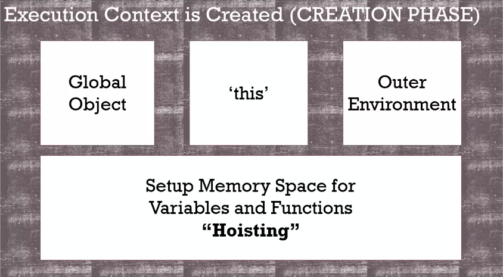

# Creation and Hoisting

The execution context is created in two phases.

## 1st phase - ``the creation phase``

The 1st phase is called ``the creation phase``.

In this phase, we have ``Global Object``, ``this`` and ``Outer Environment``. (these three are setted up within memory.)

In this phase, JS Engine runs your code and begins to set up what you've written for translation it. It recognizes where you create your variables and functions. It sets memory space for variables and functions in this phase ("Hoisting").



### Hoisting

```JavaScript
b();
console.log(a);

var a = 'Hello World';

function b() {
    console.log('called b!');
}
```

Hoisting: you can use variables and functions that declared later.

> **Before your code begins to be executed line by line, the JS engine has already set aside memory space for the variables that you've created in that entire code that you've built, and all of the functions that you've created as well, so those variables and functions exist in memory.**
>
> **So when the code executes line by line, it can access them.**

### difference between ``hoisting`` 'functions' and 'variables'

The function is entirely placed into memory space, meaning the function, its name and the code inside the function is being executed.

When setting up memory space for variables, JS engine hasn't executed the value-assginement for the variable, so in the creation phase, JS engine puts a placeholder for it call ``undefined``.

> All variables are setted up as ``undefined``. 
>
> All functions are entirely sittting in memory space.

## ATTENTION

Don't rely on ``hoisting``. 

You can come out to find that variable is undefined instead of the value you expectg.

Better to do this:

```JavaScript
var a = 'Hello World';

function b() {
    console.log('called b!');
}

b();
console.log(a);
```