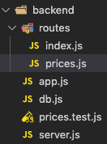

# backend routes

/routes/index.js
    /prices -> pricesRouter
    /products/(id)/prices -> pricesRouter

/routes/pricesRouter.js
    GET /
    POST /

app.js
    app.use(routes/index.js)

## [Routing with NodeJS (Express)](https://medium.com/@cmpbilge/routing-with-nodejs-express-4ce79752e146)

### The hierarchy of the routes folder

```JavaScript
api/routes
├── index.js
├── root.js
├── account.js
```

**``server/app.js``**

```JavaScript
const routes = require('./api/routes');
app.use("/", routes);
```

Every routes folder should have an ``index.js`` file. The ``index.js`` file does the subrouting process like urls start with “``/account``” are routed in the ``account.js`` etc.

### Content of **``index.js``**

```JavaScript
const express = require("express");

const rootRoutes = require('./root');
const accountRoutes = require('./account.js');

const router = express.Router();

router.use("/", rootRoutes);
router.use("/account", accountRoutes);

module.exports = router;
```

### Content of **``root.js``**

```JavaScript
const express = require("express");
const mainController = require("../controllers/main");
const router = express.Router();

router
  .route("/")
  .get(mainController.landingPage);

router
  .route("/dashboard")
  .get(mainController.dashboardPage);

module.exports = router;
```

Here we define one of our controllers as mainController to access its functions. Then we route the get requests for landing page and dashboard page to handling functions in our controller which renders the responding page.

### Content of **``account.js``**

```JavaScript
const express = require("express");
const accountController = require("../controllers/account");
const router = express.Router();

router
  .route("/login")
  .get(accountController.loginPage)
  .post(accountController.userLogin);

router
  .route("/signup")
  .get(accountController.signupPage)
  .post(accountController.createUser);

router
  .route("/logout")
  .get(accountController.logout);

module.exports = router;
```

Here we did thing similar to we did in root.js except handling the post requests.

## Routing pathway

We have build an simple routing example. If some one send a get request to ``/account/login`` this request first gets handled by ``server/app.js`` file then it passes this request to ``api/routes/index.js`` file and index.js file handles the subrouting process and passes this request to ``api/routes/account.js`` file and finally here this request gets passed to the responding function in controller.

To sum up

```
server/app.js -> api/routes/index.js -> api/routes/account.js ->  Routing ends
```

# My Example



**``server.js``**

```JavaScript
import server from './app';

const app = server();

const PORT = 3000;

app.listen(PORT);
```

**``app.js``**

```JavaScript
import express from 'express';
import cors from 'cors';

import routes from './routes';

export default () => {
  const app = express();
  app.use(cors());
  app.use(express.json());
  app.use(express.urlencoded({ extended: true }));

  app.use('/', routes);
  return app;
};
```

**``/routes/index.js``**

```JavaScript
import express from 'express';

import pricesRouter from './prices';

const router = express.Router();

router.use('/prices', pricesRouter);

module.exports = router;
```

**``/routes/prices.js``**

```JavaScript
import express from 'express';

import prices from '../db';

const pricesRouter = express.Router();

const getPricesFromDB = async () => prices;

pricesRouter.get('/getAllPrices', async (req, res, next) => {
  let pricesData = null;
  try {
    pricesData = await getPricesFromDB();

    if (!Array.isArray(prices)) {
      return res.status(400).send({
        error: 'prices need to be an array',
      });
    }
  } catch (error) {
    next(error);
  }

  res.set('count', prices.length);
  return res.status(200).send({
    data: pricesData,
  });
});

const saveNewPricesToDB = async (newPrices) => prices.concat(newPrices);

pricesRouter.post('/addNewPrices', async (req, res, next) => {
  if (!Array.isArray(req.body)) {
    return res.status(400).send({
      error: 'data format need to be an array',
    });
  }

  if (req.body.length === 0) {
    return res.status(201).send({
      message: 'no new prices are added, because the incoming data is empty',
    });
  }

  const properties = ['timeStamp', 'price'];
  const check = req.body.every((entry) => properties.every((property) => property in entry && typeof entry[property] === 'number'));
  if (!check) {
    return res.status(400).send({
      error: 'data format is wrong',
    });
  }

  try {
    await saveNewPricesToDB(req.body);
  } catch (error) {
    next(error);
  }

  return res.status(201).send({
    newData: req.body,
  });
});

export default pricesRouter;
```

**``prices.test.js``**

```JavaScript
import supertest from 'supertest';
import server from './app';
import prices from './db';

describe('test /prices routes', () => {
  const app = server();

  let request;

  beforeEach(() => {
    request = supertest(app);
  });

  describe('GET /prices/getAllPrices', () => {
    it('when success, responds json : status code 200, success "true", message "prices retrieved successfully" and an array of data which is pricesData', async () => {
      const response = await request.get('/prices/getAllPrices');

      expect(response.status).toBe(200);
      expect(response.body.data).toStrictEqual(prices);
    });
  });

  describe('POST /prices/addNewPrices', () => {
    it('when data format is not an array, responds json : status code 200, success "false", message "data format need to be an array"', async () => {
      const response = await request
        .post('/prices/addNewPrices')
        .send({ timestamp: '1000', price: '2000' });

      expect(response.status).toBe(400);
      expect(response.body.error).toBe('data format need to be an array');
    });

    it('when [], responds json : status code 201, success "true", message "no new prices are added, because the incoming data is empty"', async () => {
      const response = await request
        .post('/prices/addNewPrices')
        .send([]);

      expect(response.status).toBe(201);
      expect(response.body.message).toBe('no new prices are added, because the incoming data is empty');
    });

    it('when missing one or more property of data, responds json : status code 400, success "false", message "data format is wrong"', async () => {
      const response = await request
        .post('/prices/addNewPrices')
        .send([{ timeStamp: 325, price: 3243 }, { timeStamp: 1000 }]);

      expect(response.status).toBe(400);
      expect(response.body.error).toBe('data format is wrong');
    });

    it('when success, responds json : status code 201, success "true", message "new price added successfully" and an array of data which is newData', async () => {
      const response = await request
        .post('/prices/addNewPrices')
        .send([{ timeStamp: 325, price: 3243 }, { timeStamp: 1000, price: 100 }]);

      expect(response.status).toBe(201);
      // eslint-disable-next-line max-len
      expect(response.body.newData).toStrictEqual([{ timeStamp: 325, price: 3243 }, { timeStamp: 1000, price: 100 }]);
    });
  });
});
```