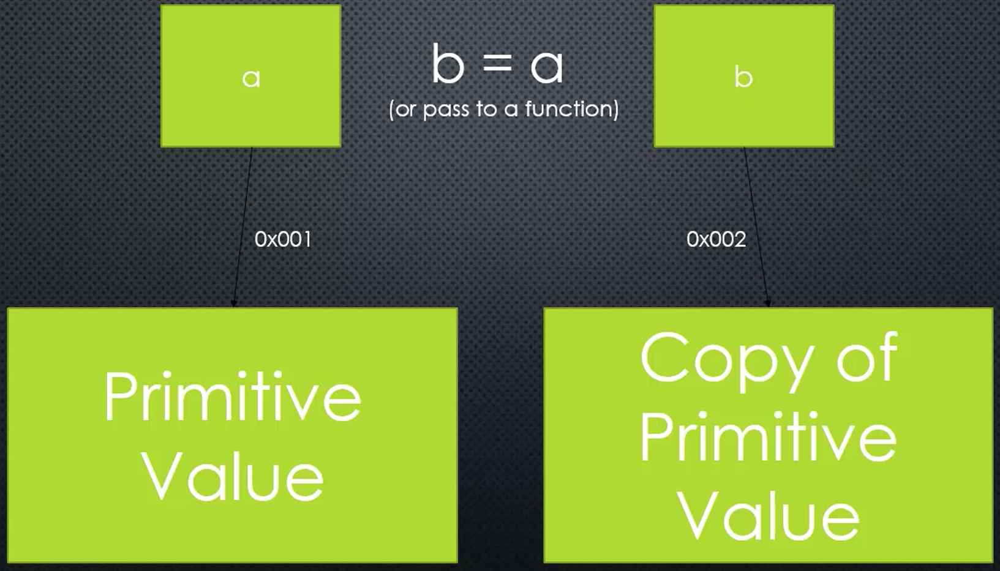

# By Reference and By Value

> How JavaScript handles when you **pass a value (an object or a primitive) to a function**?

## Primitive

> A type of data that represents a single value. (Like a number or a string. In other words, **not an object**.)

### pass by value



```JavaScript
// pass by value
function change(b) {
    b = 2;
}

var a = 1;
change(a);
console.log(a); // 1
```

### pass by reference


```JavaScript
// pass by reference
function changeObj(d) {
    d.prop1 = function() {};
    d.prop2 = {};
}

var c = {};
c.prop1 = {};
console.log(c);

$ node app.js
{ prop1: [function], prop2: {} }
```

d points to the same memory location that c points to.
