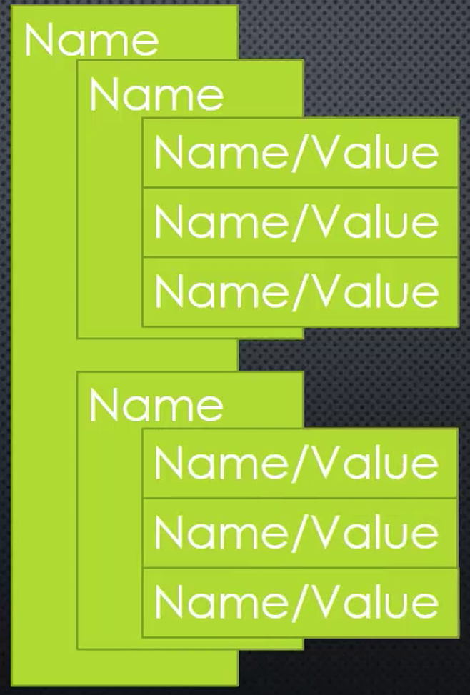
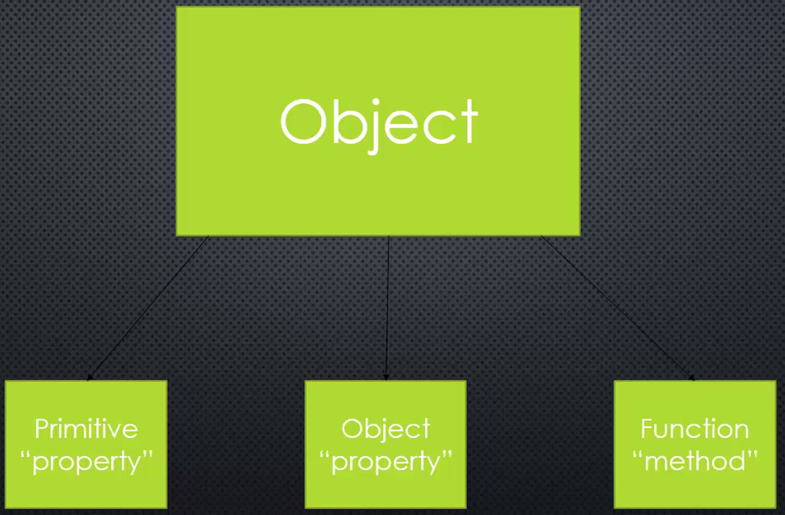

# Object and object litterals

## Object

> **A collection of name/value pair.**

JS object can has nested js objects of name/value pair.


In memory, JS object can point to primitive values, or another objects. It can also have functions. Inside JS objects, functions are called "methods".



## Object Litteral

> **Name/value pairs separated by commas and surrouned by curly braces.**

This is just a quick, shorthand way to create JavaScript objects in code.

```JavaScript
{
    Street: 'Main',
    Number: 100,
    Apartment:
    {
        Floor: 3,
        Number: 301
    }
}
```
