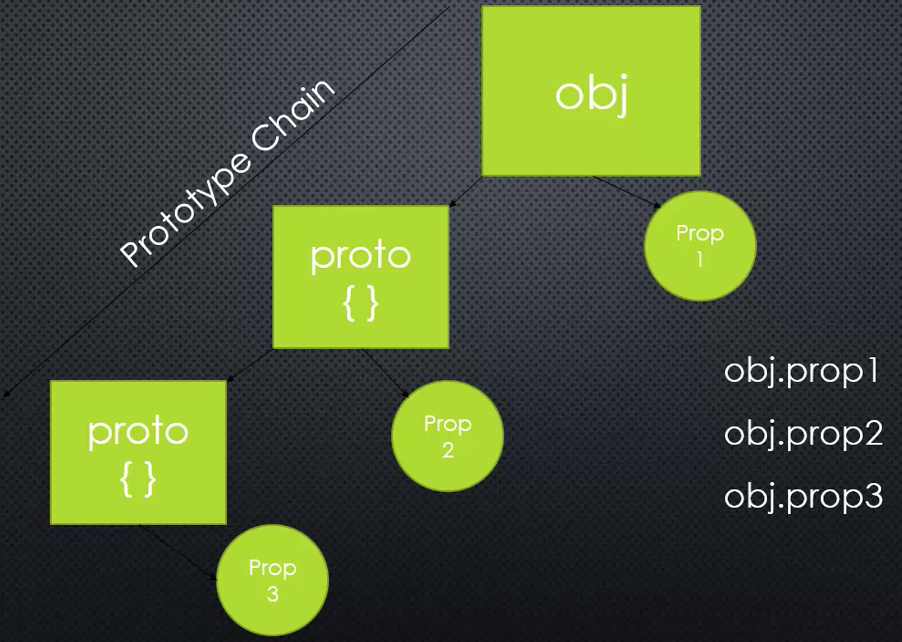
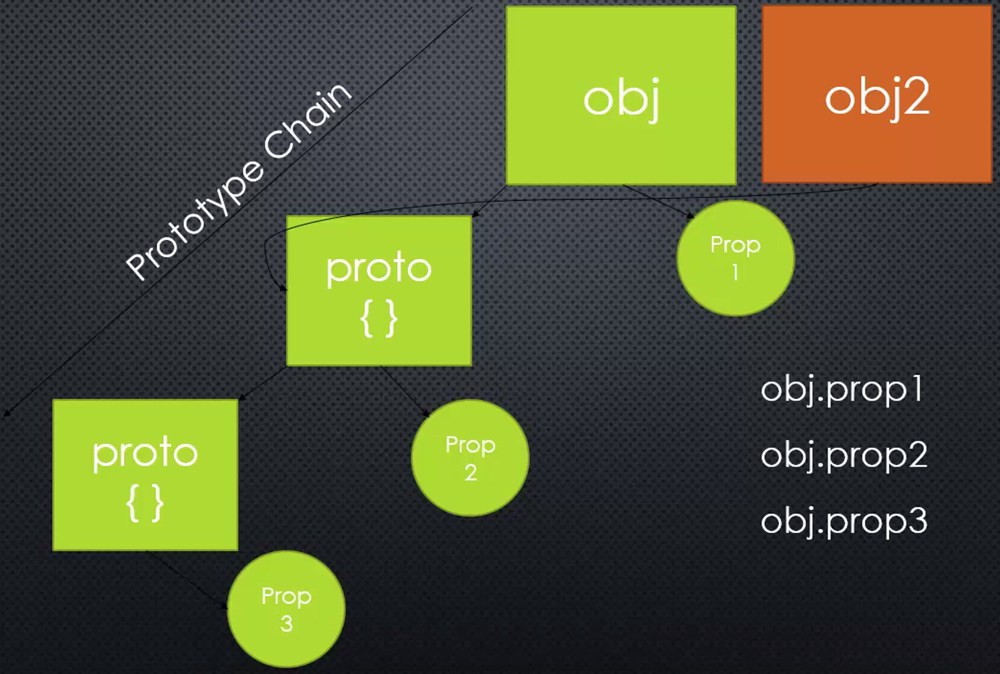

# Prototypal Inheritance and Function Constructors

## Inheritance

> **One object gets access to the properties (name/value pairs) and methods of another object.**

However, JavaScript implements inheritance differently from other programming languages.

## Prototype Chain



### E.X

An object has some properties, some values, like first name, last name, address etc. That's a ``property``. And we access to that property by using ``the dot operation``.

Every object has a property that **actually points to another object**. It's the ``object propertype``. It's the thing it inherits from. It's a different object that it will then have access to that other object's properties and methods. So, we can say ``obj.prop2`` whatever that other property is on the prototype and we can have access to it as if it was directly attached to my object.

The prototype also might point to a prototype. Its own prototype, a different object which might have its own properties and methods, and we can still take my object and say dot whatever property name and we'll still have access to it.

So it's not just directly connected to my object, but down what's called the ``prototype chain``.

> **I have a sequence of objects connected to each other. And I can access properties on any of thoes objects down the line without having to specify which one it is.** ----> ``Prototype Inheritance``



E.X., I could make another object, a separate object, and it could point to the same properties as other objects do. So they can share properties and methods. And I could change the property or method, or add a new property or method to the prototype. And ``in every object that inherits from it, every object that points to it as its prototype, will instantly get access to it.``

## Q: How do I manage to build this prototype chain and constructing our objects?

ways to build ``objects``:

1. object literral {}
2. es6 class
   1. function constructor

## Function Constructors

> A normal function that is used to construct objects.

The ``'this'`` variable points a new empty object, and that object is returned from the function automatically.

We can say ``new`` and then call this constructor function, what that will do is to execute the function. **It will take this keyword, make that a new empty object. We can then use this keyword to construct our object, adding properties and methods to it. And the function constructor will return that new object from the function call.**

## E.X. - Build a function constructor

A function constructor is just a regular function. (start the function name by a capital letter to indicate it's a function constructor.)

When a function constructor is called by the ``new`` keyword, ``this`` keyword will be automatically an empty object and then I can attach things on it.

``firstname`` and ``secondname`` are the parameters passed into this function that I want this object to have.

```JavaScript
function Person(firstname, secondname) {
    this.firstname = firstname;
    this.secondname = secondname;
}
var john = new Person('John', 'Doe');
console.log(john.firstname);
```

``var john = new Person('John', 'Doe');``, ``new`` keyword executes the function constructor, automatically makes ``this`` an empty object, and then return this object pointed by ``this``, then the properties ``firstname`` and ``secondname`` are added to this object pointed by ``this``.

### What about the ``prototype``?

``prototype`` the thing that the object ``john`` inherits from. Funtions are special kinds of objects. So I can have properties and methods in functions as well. There's a built-in one called ``prototype``. That's just an object, an another object, but I can attach properties and methods to this prototype object as well.

```JavaScript
function Person(firstname, secondname) {
    this.firstname = firstname;
    this.secondname = secondname;
}

// have a greet function on this prototype
Person.prototype.greet = function() {
    console.log('Hello, ' + this.firstname + ' ' + this.secondname);
} // 'this' keyword points to this empty object


var john = new Person('John', 'Doe');
john.greet(); // this will search down the prototype chain

var jane = new Person('Jane', 'Doe');
jane.greet();
```

An object created from the function constructor, its prototype will point to the prototype property of the function that you used to construct the object.

Whenever you see this dot prototype property in code, what's happening is we're **adding some methods and properties to be availble to all objects created from this particular function constructor.**

We can actually look at what the prototype is (this is not recommended to use in any production code):

```JavaScript
console.log(john.__proto__); // output: { greet: [function] }
console.log(jane.__proto__); // output: { greet: [function] }
console.log(john.__proto__ === jane.__proto__); // true --- prototype object is the same one which is ``Person.prototype``, so john object and jane object both have access to greet function.
```

The JavaScript Engine searches down the prototype chain to allow john and jane, **any objects created from this person function constructor to have access to inherit these properties and methods from any of those prototypes down the chain.**

So if this Person.prototype also had a prototype with a different method on it, or a property, the objects will still have access to those as well.

```JavaScript
function Person(firstname, lastname) {
    this.firstname = firstname;
    this.lastname = lastname;
    this.greet = function () {
        console.log('greet inside');
    };
}

Person.prototype.hello = function () {
    console.log('greet outside');
}

var john = new Person('John', 'Doe');
var jane = new Person('Jane', 'Doe');
console.log(john.greet() === jane.greet()); // true
console.log(john.__proto__ === jane.__proto__); // true

console.log(john);
console.log(jane);
console.log(john.__proto__);
console.log(jane.__proto__);
```

output:

```JavaScript
$ node app.js
greet inside
greet inside
true
true
Person { firstname: 'John', lastname: 'Doe', greet: [Function] }
Person { firstname: 'Jane', lastname: 'Doe', greet: [Function] }
Person { hello: [Function] }
Person { hello: [Function] }
```
