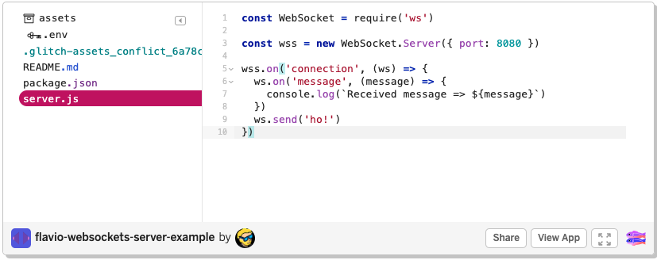
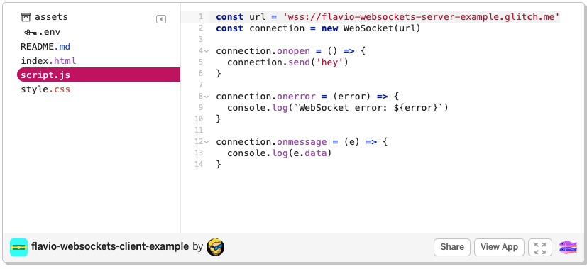

# [Web Socket](https://javascript.info/websocket#summary)

One of the most popular of these strategies was ***long-polling***. This involves keeping an HTTP connection open until the server has some data to push down to the client.

The problem with all of these solutions is that they carry the overhead of HTTP. Every time you make an HTTP request a bunch of headers and cookie data are transferred to the server. This can add up to a reasonably large amount of data that needs to be transferred, which in turn increases latency. If you’re building something like a browser-based game, ***reducing latency is crucial to keeping things running smoothly***. The worst part of this is that a lot of these headers and cookies aren’t actually needed to fulfil the client’s request.

> What we really need is a way of ***creating a persistent, low latency connection that can support transactions initiated by either the client or server***. This is exactly what WebSockets provide and in this post you are going to learn all about how to use them in your own applications.

> The WebSocket protocol provides a way to exchange data between browser and server via a persistent connection.
>
> The data can be passed in both directions as **“packets”**, without breaking the connection and additional HTTP-requests.
>
> WebSocket is especially great for services that **require continuous data exchange**

1. **A simple example**
2. **Opening a websocket**
3. **Extensions and subprotocols**
4. **Data transfer**
5. **Rate limiting**
6. **Connection close**
7. **Connection state**
8. **Chat example**
9. **Summary**

## 1. **A simple example**

To open a websocket connection, we need to **create new WebSocket** using the special protocol ``ws`` in the url:

```JavaScript
let socket = new WebSocket("ws://javascript.info");
```

(encrypted ``wss://`` protocol. It’s like **HTTPS** for websockets.)

> ### **Always prefer ``wss://``**
> ---
> 
> The ``wss://`` protocol not only encrypted, but also more reliable.
>
> That’s because ``ws://`` data is not encrypted, visible for any intermediary. Old proxy servers do not know about WebSocket, they may see “strange” headers and abort the connection.
>
> On the other hand, ``wss://`` is WebSocket over TLS, (same as HTTPS is HTTP over TLS), the transport security layer encrypts the data at sender and decrypts at the receiver. So data packets are passed encrypted through proxies. They can’t see what’s inside and let them through.

**Once the socket is created, we should listen to events on it.** There are totally 4 events:

1. ``open`` – connection established,
2. ``message`` – data received,
3. ``error`` – websocket error,
4. ``close`` – connection closed.
5. ``socket.send(data)`` - send something

```JavaScript
let socket = new WebSocket("wss://javascript.info/article/websocket/demo/hello");

socket.onopen = function(e) {
  alert("[open] Connection established");
  alert("Sending to server");
  socket.send("My name is John");
};

socket.onmessage = function(event) {
  alert(`[message] Data received from server: ${event.data}`);
};

socket.onclose = function(event) {
  if (event.wasClean) {
    alert(`[close] Connection closed cleanly, code=${event.code} reason=${event.reason}`);
  } else {
    // e.g. server process killed or network down
    // event.code is usually 1006 in this case
    alert('[close] Connection died');
  }
};

socket.onerror = function(error) {
  alert(`[error] ${error.message}`);
};
```

## 2. **Opening a websocket**

### How WebSockets Work

> **WebSockets provide a persistent connection between a client and server that both parties can use to start sending data at any time.**

The client establishes a WebSocket connection through a process known as the ``WebSocket handshake.`` This process starts with the client sending a regular HTTP request to the server. An **``Upgrade``** header is included in this request that **informs the server that the client wishes to establish a WebSocket connection.**

When ``new WebSocket(url)`` is created, it starts connecting immediately.

During the connection the browser (using headers) asks the server: “Do you support Websocket?” And if the server replies “yes”, then the talk continues in WebSocket protocol, which is not HTTP at all.


Here’s an example of browser headers for request made by ``new WebSocket("wss://javascript.info/chat")``.

initial request headers
```HTTP
GET /chat
Host: javascript.info
Origin: https://javascript.info
Connection: Upgrade
Upgrade: websocket
Sec-WebSocket-Key: Iv8io/9s+lYFgZWcXczP8Q==
Sec-WebSocket-Version: 13
```

If the server supports the WebSocket protocol, it agrees to the upgrade and communicates this through an Upgrade header in the response.

```HTTP
HTTP/1.1 101 WebSocket Protocol Handshake
Date: Wed, 16 Oct 2013 10:07:34 GMT
Connection: Upgrade
Upgrade: WebSocket
```

Now that the handshake is complete the initial HTTP connection is replaced by a WebSocket connection that uses the same underlying TCP/IP connection. At this point either party can starting sending data.

- **``Origin``** – the origin of the client page.
  - WebSocket objects are ***``cross-origin`` by nature***.
  - There are no special headers or other limitations.
  - But Origin header is important, as it allows the server to decide whether or not to talk WebSocket with this website.
- **``Connection: Upgrade``** – signals that the client would like to change the protocol.
- **``Upgrade: websocket``** – the requested **protocol** is ``“websocket”``.
- **``Sec-WebSocket-Key``** – a **random browser-generated key** for security.
- **``Sec-WebSocket-Version``** – WebSocket protocol version, 13 is the current one.

> ### **WebSocket handshake can’t be emulated**
>
> ---
>
> We can’t use ``XMLHttpRequest`` or ``fetch`` to make this kind of HTTP-request, because JavaScript is not allowed to set these headers.

If the **server** agrees to switch to WebSocket, it should send code ``101`` response:

```HTTP
101 Switching Protocols
Upgrade: websocket
Connection: Upgrade
Sec-WebSocket-Accept: hsBlbuDTkk24srzEOTBUlZAlC2g=
```

Here ``Sec-WebSocket-Accept`` is ``Sec-WebSocket-Key``, recoded using a special algorithm. **The browser uses it to make sure that the response corresponds to the request.**

With WebSockets you can transfer as much data as you like without incurring the overhead associated with traditional HTTP requests. Data is transferred through a WebSocket as messages, each of which consists of one or more frames containing the data you are sending (the payload). In order to ensure the message can be properly reconstructed when it reaches the client each frame is prefixed with 4-12 bytes of data about the payload. Using this frame-based messaging system helps to reduce the amount of non-payload data that is transferred, leading to significant reductions in latency.

## 3. **Extensions and subprotocols**

## 4. **Data transfer**

WebSocket communication consists of **“frames”** – **data fragments**, that can be sent from either side, and can be of several kinds:

- **“``text frames``”** – contain ***text data*** that parties send to each other.
- **“``binary data frames``”** – contain ***binary data*** that parties send to each other.
  - **“``ping/pong frames``”** are used to ***check the connection***, sent from the server, the browser responds to these automatically.
- there’s also **“``connection close frame``”** and a few ***other service frames.***

> In the browser, we directly work only with ``text`` or ``binary`` frames.

> **WebSocket .send() method can send either text or binary data.**

A call ``socket.send(body)`` allows body in **string** or a **binary** format, including **Blob**, **ArrayBuffer**, etc. No settings required: just send it out in any format.

> When we **receive** the data, **text** always comes as string. And for **binary** data, we can choose between **Blob** and **ArrayBuffer** formats.

That’s set by ``socket.bufferType`` property, it’s "blob" by default, so binary data comes as Blob objects.

**Blob** is a high-level binary object, it directly integrates with ``<a>``, ```` and other tags, so that’s a sane default. But for binary processing, to access individual data bytes, we can change it to "``arraybuffer``":

```JavaScript
socket.bufferType = "arraybuffer";
socket.onmessage = (event) => {
  // event.data is either a string (if text) or arraybuffer (if binary)
};
```

## 5. **Rate limiting**

We can call ``socket.send(data)`` **again and again**. **But the data will be buffered (stored) in memory and sent out only as fast as network speed allows.**

The ``socket.bufferedAmount`` property stores how many bytes are buffered at this moment, waiting to be sent over the network.

We can examine it to see whether the socket is actually available for transmission.

```JavaScript
// every 100ms examine the socket and send more data
// only if all the existing data was sent out
setInterval(() => {
  if (socket.bufferedAmount == 0) {
    socket.send(moreData());
  }
}, 100);
```

## 6. **Connection close**

Normally, when a party wants to close the connection (both browser and server have equal rights), they send a “connection close frame” with **a numeric code and a textual reason.**

```JavaScript
socket.close([code], [reason]);
```

- **``code``** is a special WebSocket **closing code** (optional)
- **``reason``** is a string that describes **the reason of closing** (optional)

Then the other party in close event handler gets the code and the reason, e.g.:

```JavaScript
// closing party:
socket.close(1000, "Work complete");

// the other party
socket.onclose = event => {
  // event.code === 1000
  // event.reason === "Work complete"
  // event.wasClean === true (clean close)
};
```

Most common code values:

- 1000 – the default, normal closure (used if no code supplied),
- 1006 – no way to such code manually, indicates that the connection was lost (no close frame).

```JavaScript
// in case connection is broken
socket.onclose = event => {
  // event.code === 1006
  // event.reason === ""
  // event.wasClean === false (no closing frame)
};
```

There are other codes like:

- 1001 – the party is going away, e.g. server is shutting down, or a browser leaves the page,
- 1009 – the message is too big to process,
- 1011 – unexpected error on server,
…and [so on](https://tools.ietf.org/html/rfc6455#section-7.4.1).

WebSocket codes are somewhat like HTTP codes, but different. In particular, any codes less than 1000 are reserved, there’ll be an error if we try to set such a code.

## 7. **Connection state**

To get connection state, additionally there’s socket.readyState property with values:

- 0 – “**CONNECTING**”: the connection has not yet been **established**,
- 1 – “**OPEN**”: **communicating**,
- 2 – “**CLOSING**”: the connection is **closing**,
- 3 – “**CLOSED**”: the connection is **closed**.

## 8. **Chat example**

a chat example using ``browser WebSocket API`` and ``Node.js WebSocket module``  [(https://github.com/websockets/ws)](https://github.com/websockets/ws)

HTML
```HTML
<!-- message form -->
<form name="publish">
  <input type="text" name="message">
  <input type="submit" value="Send">
</form>

<!-- div with messages -->
<div id="messages"></div>
```

Client side 

> From JavaScript we want three things:
>
> 1. Open the connection.
> 2. On form submission – socket.send(message) for the message.
> 3. On incoming message – append it to div#messages.

```JavaScript
let socket = new WebSocket("wss://javascript.info/article/websocket/chat/ws");

// send message from the form
document.forms.publish.onsubmit = function() {
  let outgoingMessage = this.message.value;

  socket.send(outgoingMessage);
  return false;
};

// message received - show the message in div#messages
socket.onmessage = function(event) {
  let message = event.data;

  let messageElem = document.createElement('div');
  messageElem.textContent = message;
  document.getElementById('messages').prepend(messageElem);
}
```

Server side

> The server-side algorithm will be:
>
> 1. Create ``clients = new Set()`` – a set of sockets.
> 2. For each accepted websocket, add it to the set ``clients.add(socket)`` and setup ``message`` event listener to get its messages.
> 3. When a message received: iterate over clients and send it to everyone.
> 4. When a connection is closed: ``clients.delete(socket)``.

```JavaScript
const ws = new require('ws');
const wss = new ws.Server({noServer: true});

const clients = new Set();

http.createServer((req, res) => {
  // here we only handle websocket connections
  // in real project we'd have some other code here to handle non-websocket requests
  wss.handleUpgrade(req, req.socket, Buffer.alloc(0), onSocketConnect);
});

function onSocketConnect(ws) {
  clients.add(ws);

  ws.on('message', function(message) {
    message = message.slice(0, 50); // max message length will be 50

    for(let client of clients) {
      client.send(message);
    }
  });

  ws.on('close', function() {
    clients.delete(ws);
  });
}
```

> Just don’t forget to install Node.js and ``npm install ws`` before running.

## 9. **Summary**

WebSocket is a modern way to have persistent browser-server connections.

- WebSockets don’t have cross-origin limitations.
- They are well-supported in browsers.
- Can send/receive strings and binary data.
- The API is simple.

Methods:

- ``socket.send(data)``,
- ``socket.close([code], [reason])``.

Events:

- ``open``,
- ``message``,
- ``error``,
- ``close``.
  
WebSocket by itself does not include reconnection, authentication and many other high-level mechanisms. So there are client/server libraries for that, and it’s also possible to implement these capabilities manually.

Sometimes, to integrate WebSocket into existing project, people run WebSocket server in parallel with the main HTTP-server, and they share a single database. Requests to WebSocket use ``wss://ws.site.com``, a subdomain that leads to WebSocket server, while ``https://site.com`` goes to the main HTTP-server.

## 10. [Another Example](https://codepen.io/matt-west/pen/tHlBb)

HTML

```HTML
<div id="page-wrapper">
  <h1>WebSockets Demo</h1>
  
  <div id="status">Connecting...</div>
  
  <ul id="messages"></ul>
  
  <form id="message-form" action="#" method="post">
    <textarea id="message" placeholder="Write your message here..." required></textarea>
    <button type="submit">Send Message</button>
    <button type="button" id="close">Close Connection</button>
  </form>
</div>
```

app.js

```JavaScript
window.onload = function() {

  // Get references to elements on the page.
  var form = document.getElementById('message-form');
  var messageField = document.getElementById('message');
  var messagesList = document.getElementById('messages');
  var socketStatus = document.getElementById('status');
  var closeBtn = document.getElementById('close');


  // Create a new WebSocket.
  var socket = new WebSocket('wss://echo.websocket.org');


  // Handle any errors that occur.
  socket.onerror = function(error) {
    console.log('WebSocket Error: ' + error);
  };


  // Show a connected message when the WebSocket is opened.
  socket.onopen = function(event) {
    socketStatus.innerHTML = 'Connected to: ' + event.currentTarget.url;
    socketStatus.className = 'open';
  };


  // Handle messages sent by the server.
  socket.onmessage = function(event) {
    var message = event.data;
    messagesList.innerHTML += '<li class="received"><span>Received:</span>' + message + '</li>';
  };


  // Show a disconnected message when the WebSocket is closed.
  socket.onclose = function(event) {
    socketStatus.innerHTML = 'Disconnected from WebSocket.';
    socketStatus.className = 'closed';
  };


  // Send a message when the form is submitted.
  form.onsubmit = function(e) {
    e.preventDefault();

    // Retrieve the message from the textarea.
    var message = messageField.value;

    // Send the message through the WebSocket.
    socket.send(message);

    // Add the message to the messages list.
    messagesList.innerHTML += '<li class="sent"><span>Sent:</span>' + message + '</li>';

    // Clear out the message field.
    messageField.value = '';

    return false;
  };


  // Close the WebSocket connection when the close button is clicked.
  closeBtn.onclick = function(e) {
    e.preventDefault();

    // Close the WebSocket.
    socket.close();

    return false;
  };

};
```

### Monitoring WebSocket Traffic with the Chrome Dev Tools

Open ``index.html`` in your browser and try sending some messages. You should see that the server echoes your messages back to you.

Chrome DevTools


Firefox DevTools


## 11. Browser support for WebSockets


## 12. How WebSockets differ from HTTP

HTTP is a very different protocol, and also a different way of communicate.

HTTP is a request/response protocol: the server returns some data when the client requests it.

With WebSockets:

- the **server can send a message to the client** without the client explicitly requesting something
- the client and the server can **talk to each other simultaneously**
- **very little data overhead** needs to be exchanged to send messages. This means a **low latency communication**.

**WebSockets** are great for **real-time** and **long-lived** communications.

**HTTP** is great for **occasional data exchange** and interactions initiated by the client.

**HTTP** is **much simpler** to implement, while WebSockets require a bit more overhead.

## 13. Secured WebSockets

Always use the secure, encrypted protocol for WebSockets, ``wss://``.

``ws://`` refers to the unsafe WebSockets version (the ``http:// ``of WebSockets), and should be avoided for obvious reasons.

## 14. Implement a server in Node.js

``ws`` is a popular WebSockets library for Node.js.

We’ll use it to **build a WebSockets server.**
 
 It can also be used to **implement a client**, and use WebSockets to communicate between two backend services.

Install it using ``npm``:

```
npm init
npm install ws
```

The code you need to write is very little:

```JavaScript
const WebSocket = require('ws')

// creates a new server on port 8080 (the default port for WebSockets)
const wss = new WebSocket.Server({ port: 8080 })

// adds a callback function when a connection is established
wss.on('connection', ws => {
  ws.on('message', message => {
    console.log(`Received message => ${message}`) // logging the messages it receives
  })
  ws.send('ho!') // sending ho! to the client
})
```

WebSockets Server - [Live Code](https://glitch.com/edit/#!/flavio-websockets-server-example)


WebSockets Client - [Live Code](https://glitch.com/edit/#!/flavio-websockets-client-example)
